# codex-hud

<p align="center">
  <a href="./README.md">中文</a> · <strong>English</strong>
</p>

<p align="center">
  <strong>An in-app Token and Cost HUD for Codex Desktop, injected through CDP and compatible with Sub2API</strong><br>
  External theme support · Local CDP injection · No modification of the official installation
</p>

This is an unofficial project that does not modify Codex installation files or create an external window, tray icon, HTTP service, or standalone statistics page
The launcher starts or attaches to a local CDP-enabled Codex renderer and updates the HUD from local session records

## Features

- Shows input tokens, output tokens, and estimated cost for the current turn, with live accumulation during generation
- Shows total session tokens, cache hit rate, and estimated session cost
- Keeps today and week cost totals in a local ledger, even if sessions are archived or deleted
- Provides two UI templates and an optional transparent background
- Supports hot reloading of `hud.js` for UI and behavior customization
- Supports a global price multiplier

## UI Templates

Select the interface with `uiTemplate` in `config.json`

| Value | Interface |
| --- | --- |
| `1` | A draggable floating HUD whose position is stored in Codex local storage |
| `2` | A horizontal statistics bar fixed above the bottom composer, grouped by turn tokens, costs, and period totals |

With `transparent: true`, normal sessions hide the panel background, border, and shadow while retaining the values and Template 2 group separators

New chat always uses an opaque appearance

## Screenshots

<p align="center">
  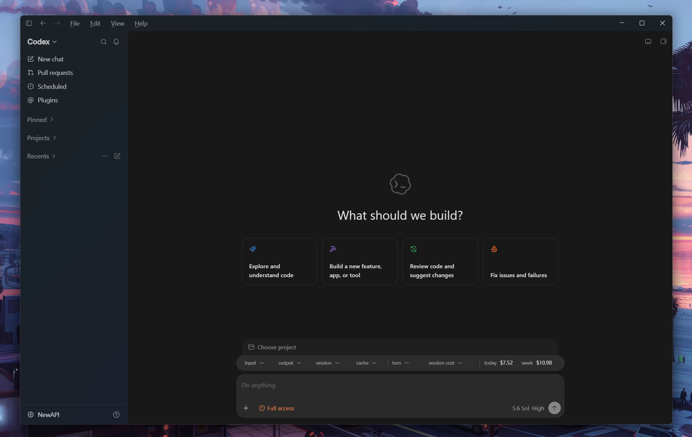
  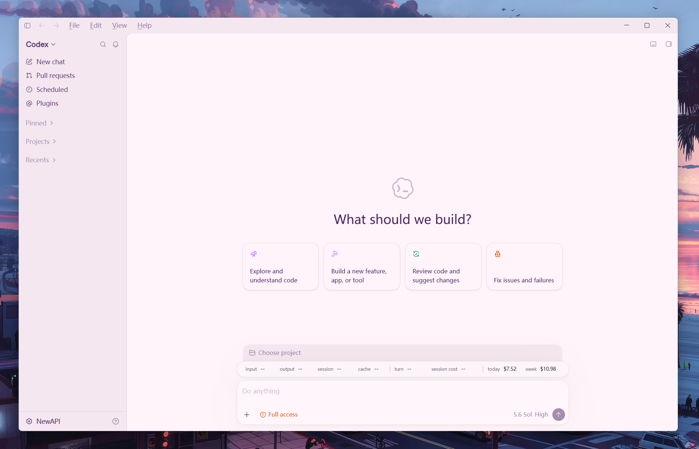
  <br><sub>New Chat</sub>
</p>

<p align="center">
  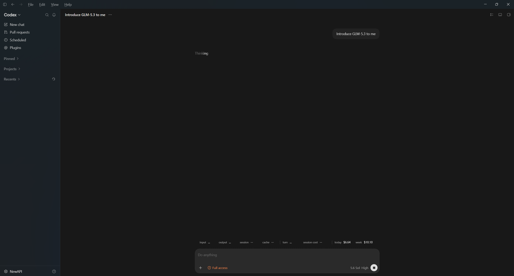
  <br><sub>Displays <code>...</code> before the turn receives usage data</sub>
</p>

<p align="center">
  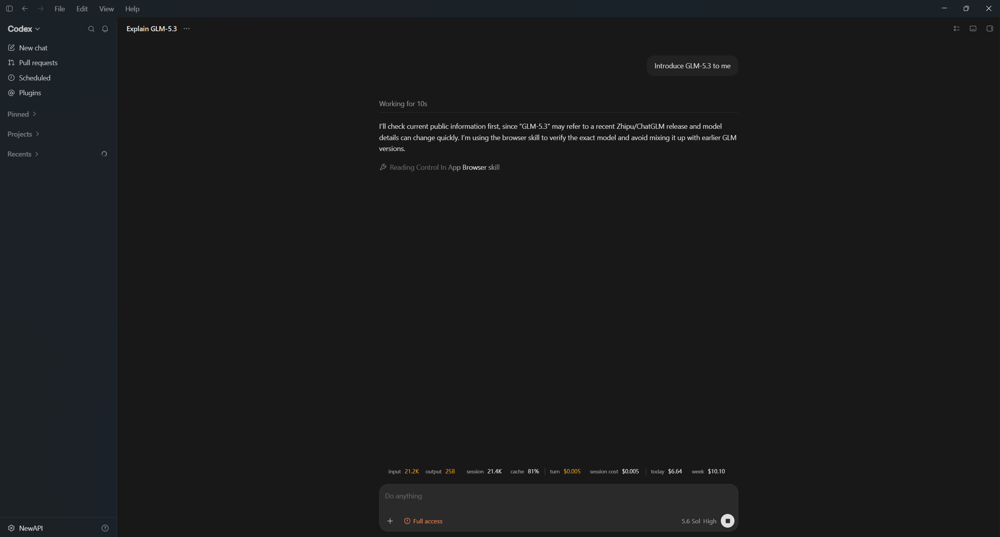
  <br><sub>Uses the configured <code>activeTurnColor</code> while the turn is active</sub>
</p>

<p align="center">
  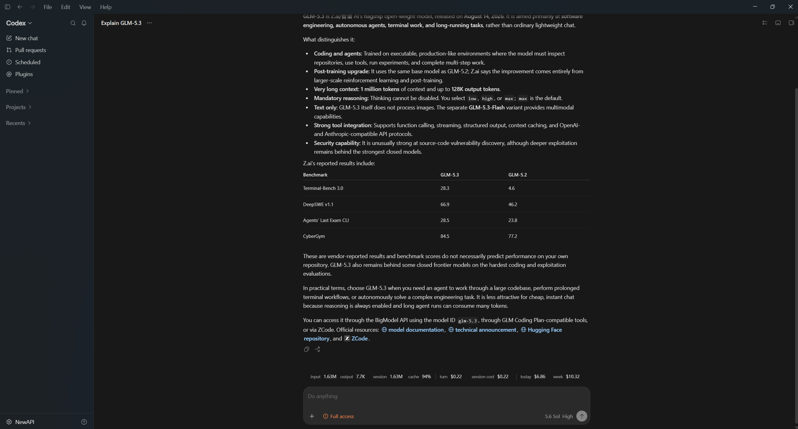
  <br><sub>Returns to white after the turn completes</sub>
</p>

<p align="center">
  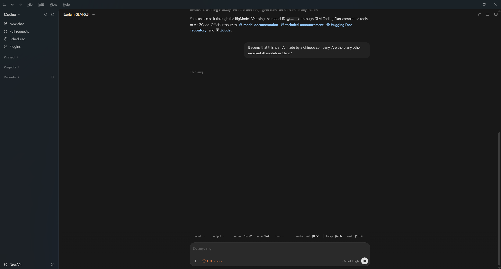
  <br><sub>Continuing a conversation in an existing session</sub>
</p>

<p align="center">
  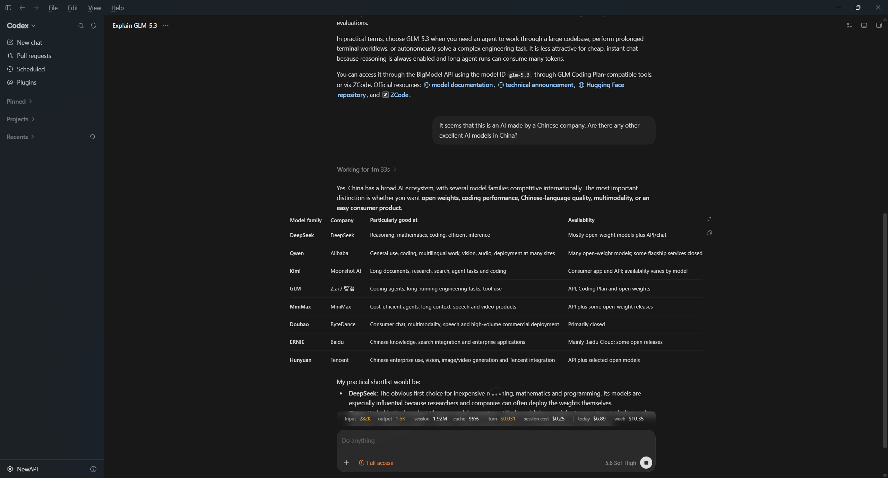
  <br><sub><code>transparent: true</code></sub>
</p>

<p align="center">
  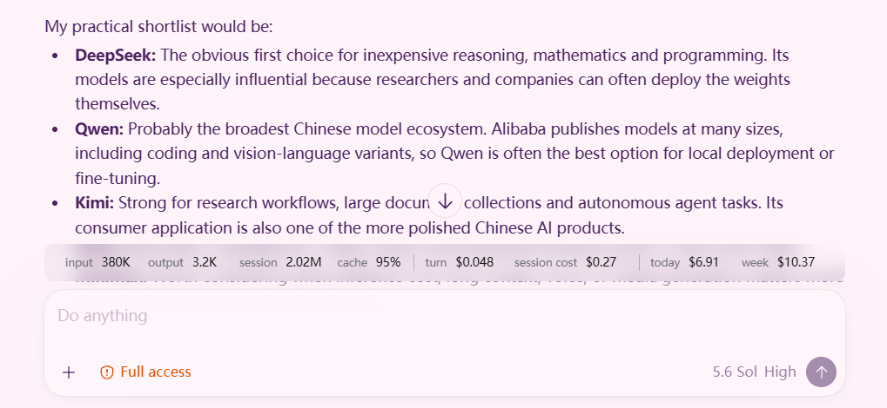
</p>

<p align="center">
  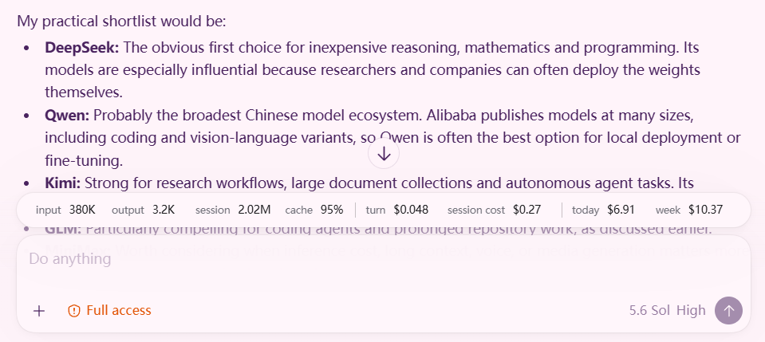
  <br><sub><code>transparent: false</code></sub>
</p>

<p align="center">
  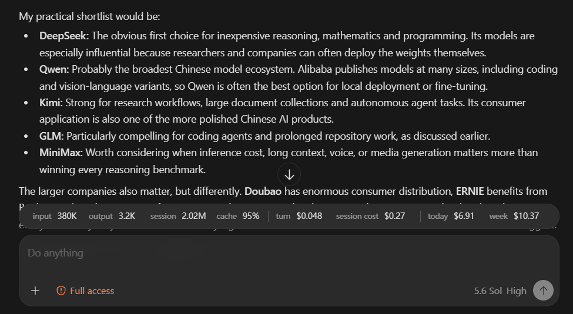
  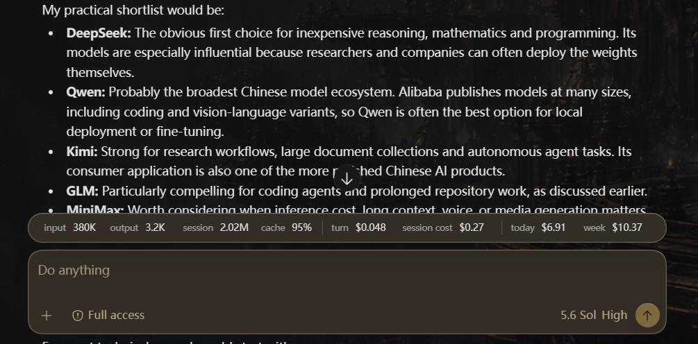
</p>

<p align="center">
  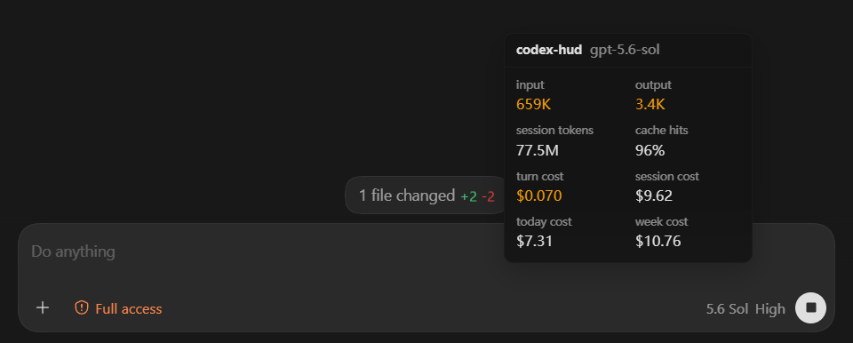
  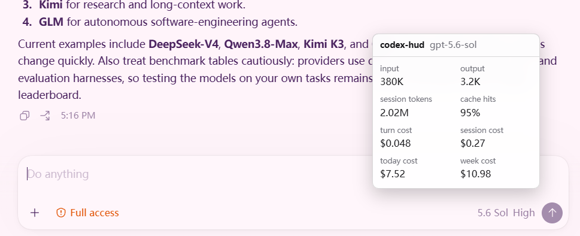
  <br><sub>UI Template 1</sub>
</p>

## Requirements

- Windows 10 or Windows 11
- Windows PowerShell 5.1
- An available loopback CDP port, `9335` by default

## Quick Start

1. Clone the repository, preferably somewhere under your user directory

   ```text
   git clone https://github.com/cultureship/codex-hud.git
   ```

2. If Codex is already running without CDP, exit it completely
3. Double-click `start-codex-hud.vbs`
4. The hidden launcher starts or attaches to Codex through CDP on `127.0.0.1`

If another local launcher has already started Codex on the same CDP port, this project attaches to that instance instead of starting a second one

To attach only to an already running CDP-enabled Codex instance, double-click `attach-codex-hud.vbs`
Attach-only mode never starts Codex and exits with a reason in `launcher.log` if a suitable instance is unavailable

You can also use a `.lnk` shortcut that targets `start-codex-hud.vbs`
Update the shortcut target after moving the project directory

## Configuration

All settings are stored in `config.json`

| Setting | Type | Description |
| --- | --- | --- |
| `debugPort` | number | Local Codex CDP port in the range `1024-65535` |
| `pollIntervalMs` | number | Fallback interval for token refresh, hot reload checks, and recovery, with a minimum of `1000` ms |
| `hotReload` | boolean | Detect and reinject changes to `hud.js` while the launcher is running |
| `cleanupOldLogs` | boolean | Remove entries older than seven days from `launcher.log` on startup |
| `cleanupOldLedger` | boolean | Retain only records from the current and previous calendar weeks |
| `uiTemplate` | number | HUD template, either `1` or `2` |
| `transparent` | boolean | Hide the HUD background, outer border, and shadow in normal sessions |
| `priceMultiplier` | number | Global multiplier applied to every calculated model cost |
| `activeTurnColor` | string | Color used for values during an active turn, accepting any valid CSS color |
| `longContextThresholdTokens` | number | Per-request input-token threshold for the long-context price tier |
| `codexPath` | string | Optional Codex executable path, left empty to find a supported Microsoft Store package automatically |
| `prices` | object | Input, cached-input, output, and optional long-context prices per one million tokens for each model |

Restart the HUD launcher after changing `config.json`
`hotReload` reloads only `hud.js`

## Data Fields

| HUD field | Meaning |
| --- | --- |
| `input` | Input tokens accumulated during the current user turn |
| `output` | Output tokens accumulated during the current user turn |
| `session` | Total tokens accumulated by the current session |
| `cache` | Cached input tokens as a percentage of total session input tokens |
| `turn` | Local cost estimate for the current turn |
| `session cost` | Local cost estimate for the current session |
| `today` | Cost recorded in the local ledger for today |
| `week` | Cost recorded in the local ledger for the current week |

### Display States

| Display | Meaning |
| --- | --- |
| `...` | A new turn has started but no token usage is available yet |
| Colored values | The current turn is active and partial token usage is available |
| White values | The turn completed or was interrupted, showing the last usage received before it ended |
| `--` | New chat, an empty session, or a session with no available token usage |

Costs are calculated only from local token data and prices in `config.json`
They do not represent the actual bill for a ChatGPT or Codex subscription

## How It Works

1. The launcher starts or attaches to Codex through CDP bound only to `127.0.0.1`
2. A sidebar listener obtains the selected session ID, while a newly created rollout can bind directly through its `session_id`
3. The launcher finds the matching `rollout-*.jsonl` under `.codex/sessions` in the user directory
4. The parser extracts only the model, turn state, and `token_count` records while maintaining an incremental read position
5. Paginated sessions merge pricing data along the `history_base` chain, with cumulative token totals used when a parent record has already been deleted
6. The launcher sends the data to the Codex renderer through CDP, and `hud.js` updates the in-app HUD

File watching provides fast current-turn updates
`pollIntervalMs` remains a fallback for recovery and exceptional cases

## Project Files

| File | Purpose |
| --- | --- |
| `start-codex-hud.vbs` | Hidden double-click entry point that starts or attaches to Codex |
| `attach-codex-hud.vbs` | Hidden attach-only entry point that never starts Codex |
| `start-codex-hud-openai.lnk` | Example shortcut using the OpenAI icon, whose target must be updated after moving the project |
| `codex-hud.ps1` | Codex startup, CDP attachment, session lookup, ledger, and injection logic |
| `hud.js` | HUD state, rendering, UI templates, and in-page data capture |
| `config.json` | Runtime settings, UI options, and model prices |
| `usage-ledger.json` | Generated local cost ledger that does not store conversation content |
| `launcher.log` | Generated startup, attachment, synchronization, and error log |

## Logs and Ledger

`launcher.log` records only startup, attachment, synchronization, and error states
With `cleanupOldLogs` enabled, each launch removes entries older than seven days

`usage-ledger.json` stores request timestamps, models, token categories, and deduplication keys for today and week totals
With `cleanupOldLedger` enabled, the launcher retains only the current and previous weeks and removes older records

## Troubleshooting

### Codex Is Running but the HUD Does Not Appear

If `launcher.log` contains:

```text
Codex is already running without CDP
```

Exit Codex completely and double-click `start-codex-hud.vbs`
CDP arguments can only be supplied when Codex starts

### The Configured Port Is Already in Use

If the log contains `Configured CDP port ... is already in use`, confirm whether the process using that port is the Codex CDP instance you intend to share
Otherwise, change `debugPort` and restart the launcher

### The HUD Shows `--`, `...`, or Stale Data

- `...` means the current turn started but has not produced token usage yet
- `--` means New chat, an empty session, or no available token usage for the current session
- Check `launcher.log` for a successful session binding with `rollout usage loaded=True`
- Confirm that `.codex/sessions` still contains `token_count` records after a Codex update

### Configuration Changes Do Not Apply

Stop and restart `start-codex-hud.vbs`
Configuration is read only at startup, while hot reload applies only to `hud.js`

## Issues

When filing an issue, include reproduction steps, the relevant `launcher.log` entries, and a redacted `config.json`

## Privacy and Security

- CDP binds only to `127.0.0.1`
- The launcher rejects non-loopback WebSocket addresses and mismatched ports
- The project does not read or upload API keys, cookies, or authentication data
- The project does not save or upload conversation content
- The project does not start an HTTP service, expose an external UI, or connect to third-party analytics
- The local ledger contains only timestamps, models, token counts, and deduplication fields required for cost totals

## Known Limitations

- Codex Desktop updates may change renderer DOM elements, sidebar attributes, or the local `token_count` format and require corresponding parser or mounting changes
- Today and week totals are local estimates, and deleting `usage-ledger.json` prevents recovery of entries whose original sessions have also been deleted
- Do not run another launcher that starts the same Codex instance on a different CDP port while this launcher is active
